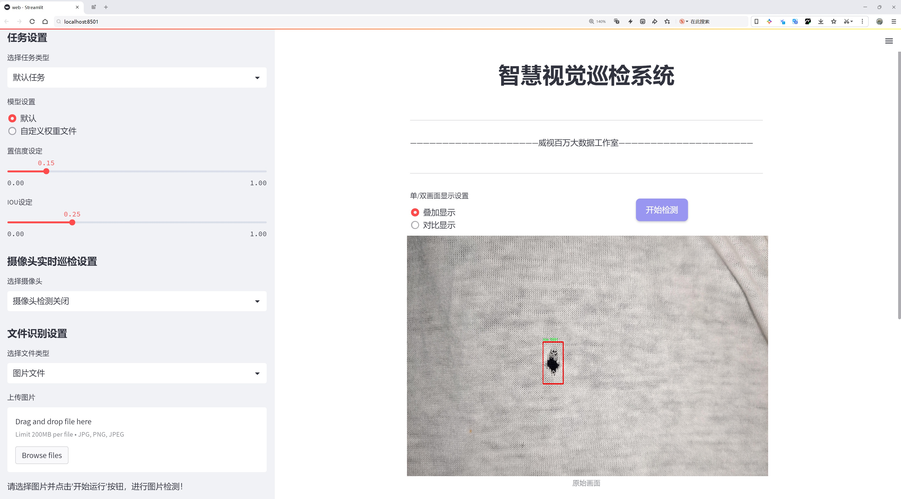

# 袋子缺陷检测系统源码分享
 # [一条龙教学YOLOV8标注好的数据集一键训练_70+全套改进创新点发刊_Web前端展示]

### 1.研究背景与意义

项目参考[AAAI Association for the Advancement of Artificial Intelligence](https://gitee.com/qunmasj/projects)

项目来源[AACV Association for the Advancement of Computer Vision](https://kdocs.cn/l/cszuIiCKVNis)

研究背景与意义

随着全球经济的快速发展和消费水平的提高，产品质量问题日益受到重视，尤其是在包装行业，袋子作为重要的包装材料，其质量直接影响到产品的安全性和消费者的满意度。因此，袋子缺陷检测系统的研究显得尤为重要。传统的人工检测方法不仅效率低下，而且容易受到人为因素的影响，导致漏检和误检的情况频繁发生。为了提高检测的准确性和效率，基于计算机视觉和深度学习的自动化检测系统逐渐成为研究的热点。

YOLO（You Only Look Once）系列模型因其高效的实时目标检测能力而广泛应用于各类视觉检测任务。YOLOv8作为该系列的最新版本，结合了更先进的网络结构和优化算法，能够在保证检测精度的同时显著提高处理速度。然而，针对特定应用场景的YOLOv8模型仍然存在一定的局限性，尤其是在处理复杂背景和多种缺陷类型时。因此，改进YOLOv8以适应袋子缺陷检测的需求，具有重要的研究价值和实际意义。

本研究围绕“d.s.d bag holes finder”模块展开，利用705张图像和8类缺陷（包括孔洞、划痕、污渍等）构建一个高效的袋子缺陷检测系统。该数据集的多样性和丰富性为模型的训练和测试提供了良好的基础。通过对YOLOv8模型的改进，能够增强其对不同类型缺陷的识别能力，提高检测的准确性和鲁棒性。这不仅有助于提升袋子生产过程中的质量控制水平，也为相关行业提供了更为可靠的技术支持。

在实际应用中，袋子缺陷检测系统的引入将极大地降低人工检测的成本和时间，提高生产效率。同时，自动化检测系统能够实现24小时不间断工作，确保生产线的高效运转。此外，系统的实时反馈机制能够及时发现和纠正生产过程中的问题，减少不合格产品的流出，进一步提升企业的市场竞争力。

综上所述，基于改进YOLOv8的袋子缺陷检测系统不仅具有重要的理论研究价值，也具备广泛的实际应用前景。通过本研究的深入探索，将为自动化检测技术的发展提供新的思路和方法，推动包装行业的智能化进程，为实现更高水平的产品质量管理奠定基础。未来，随着技术的不断进步和数据集的不断丰富，基于深度学习的缺陷检测系统将在更多领域得到应用，助力实现更高效、更智能的生产模式。

### 2.图片演示





##### 注意：由于此博客编辑较早，上面“2.图片演示”和“3.视频演示”展示的系统图片或者视频可能为老版本，新版本在老版本的基础上升级如下：（实际效果以升级的新版本为准）

  （1）适配了YOLOV8的“目标检测”模型和“实例分割”模型，通过加载相应的权重（.pt）文件即可自适应加载模型。

  （2）支持“图片识别”、“视频识别”、“摄像头实时识别”三种识别模式。

  （3）支持“图片识别”、“视频识别”、“摄像头实时识别”三种识别结果保存导出，解决手动导出（容易卡顿出现爆内存）存在的问题，识别完自动保存结果并导出到tempDir中。

  （4）支持Web前端系统中的标题、背景图等自定义修改，后面提供修改教程。

  另外本项目提供训练的数据集和训练教程,暂不提供权重文件（best.pt）,需要您按照教程进行训练后实现图片演示和Web前端界面演示的效果。

### 3.视频演示

[3.1 视频演示](https://www.bilibili.com/video/BV1FB2GYbEoj/)

### 4.数据集信息展示

##### 4.1 本项目数据集详细数据（类别数＆类别名）

nc: 8
names: ['Hole', 'Scratch', 'Stain', 'a', 'dechire', 'defect', 'pli', 'trou']


##### 4.2 本项目数据集信息介绍

数据集信息展示

在现代工业生产中，袋子作为一种重要的包装材料，其质量直接影响到产品的安全性和市场竞争力。因此，针对袋子缺陷的检测显得尤为重要。本研究所使用的数据集“d.s.d bag holes finder”专门为改进YOLOv8的袋子缺陷检测系统而设计，旨在提高检测的准确性和效率。该数据集包含了丰富的样本和多样的缺陷类型，为训练深度学习模型提供了坚实的基础。

“d.s.d bag holes finder”数据集共包含8个类别，涵盖了各种可能影响袋子质量的缺陷。这些类别分别为：Hole（孔洞）、Scratch（划痕）、Stain（污渍）、a、dechire、defect、pli和trou。每个类别代表了一种特定的缺陷特征，能够帮助模型更好地识别和分类不同类型的缺陷。通过对这些缺陷的精确标注，数据集为YOLOv8模型的训练提供了高质量的样本，确保模型能够在实际应用中实现高效的缺陷检测。

在数据集的构建过程中，研究团队注重样本的多样性和代表性，确保涵盖了不同材质、颜色和形状的袋子。这种多样性不仅增强了模型的泛化能力，还提高了其在复杂环境下的适应性。数据集中每个类别的样本数量经过精心设计，以确保在训练过程中模型能够充分学习到每种缺陷的特征。此外，数据集还包含了多种拍摄角度和光照条件下的图像，进一步提升了模型的鲁棒性。

为了便于后续的模型训练和评估，数据集的标注信息采用了标准化的格式，确保了数据的可读性和易用性。每个图像文件都配有相应的标注文件，详细记录了缺陷的类别、位置和大小等信息。这种系统化的标注方式使得研究人员能够快速地进行数据预处理和模型训练，从而节省了大量的时间和精力。

在实际应用中，改进后的YOLOv8模型将能够实时检测袋子上的各种缺陷，帮助生产线上的质量控制人员及时发现问题，减少不合格产品的流出。这不仅提高了生产效率，还降低了企业的运营成本，增强了市场竞争力。通过使用“d.s.d bag holes finder”数据集，研究团队希望能够推动袋子缺陷检测技术的发展，为相关行业提供更为精准和高效的解决方案。

总之，“d.s.d bag holes finder”数据集为改进YOLOv8的袋子缺陷检测系统提供了丰富的训练素材和坚实的理论基础。通过对数据集的深入分析和利用，研究团队期待能够在袋子缺陷检测领域取得突破性进展，为行业的发展贡献一份力量。


### 5.全套项目环境部署视频教程（零基础手把手教学）

[5.1 环境部署教程链接（零基础手把手教学）](https://www.ixigua.com/7404473917358506534?logTag=c807d0cbc21c0ef59de5)


[5.2 安装Python虚拟环境创建和依赖库安装视频教程链接（零基础手把手教学）](https://www.ixigua.com/7404474678003106304?logTag=1f1041108cd1f708b01a)

### 6.手把手YOLOV8训练视频教程（零基础小白有手就能学会）

[6.1 手把手YOLOV8训练视频教程（零基础小白有手就能学会）](https://www.ixigua.com/7404477157818401292?logTag=d31a2dfd1983c9668658)


按照上面的训练视频教程链接加载项目提供的数据集，运行train.py即可开始训练



     Epoch   gpu_mem       box       obj       cls    labels  img_size
     1/200     20.8G   0.01576   0.01955  0.007536        22      1280: 100%|██████████| 849/849 [14:42<00:00,  1.04s/it]
               Class     Images     Labels          P          R     mAP@.5 mAP@.5:.95: 100%|██████████| 213/213 [01:14<00:00,  2.87it/s]
                 all       3395      17314      0.994      0.957      0.0957      0.0843

     Epoch   gpu_mem       box       obj       cls    labels  img_size
     2/200     20.8G   0.01578   0.01923  0.007006        22      1280: 100%|██████████| 849/849 [14:44<00:00,  1.04s/it]
               Class     Images     Labels          P          R     mAP@.5 mAP@.5:.95: 100%|██████████| 213/213 [01:12<00:00,  2.95it/s]
                 all       3395      17314      0.996      0.956      0.0957      0.0845

     Epoch   gpu_mem       box       obj       cls    labels  img_size
     3/200     20.8G   0.01561    0.0191  0.006895        27      1280: 100%|██████████| 849/849 [10:56<00:00,  1.29it/s]
               Class     Images     Labels          P          R     mAP@.5 mAP@.5:.95: 100%|███████   | 187/213 [00:52<00:00,  4.04it/s]
                 all       3395      17314      0.996      0.957      0.0957      0.0845


### 7.70+种全套YOLOV8创新点代码加载调参视频教程（一键加载写好的改进模型的配置文件）

[7.1 70+种全套YOLOV8创新点代码加载调参视频教程（一键加载写好的改进模型的配置文件）](https://www.ixigua.com/7404478314661806627?logTag=29066f8288e3f4eea3a4)

### 8.70+种全套YOLOV8创新点原理讲解（非科班也可以轻松写刊发刊，V10版本正在科研待更新）

#### 由于篇幅限制，每个创新点的具体原理讲解就不一一展开，具体见下列网址中的创新点对应子项目的技术原理博客网址【Blog】：


[8.1 70+种全套YOLOV8创新点原理讲解链接](https://gitee.com/qunmasj/good)

#### 部分改进原理讲解(完整的改进原理见上图和技术博客链接)【如果此小节的图加载失败可以通过CSDN或者Github搜索该博客的标题访问原始博客，原始博客图片显示正常】
### 深度学习基础
卷积神经网络通过使用具有共享参数的卷积运算显著降低了模型的计算开销和复杂性。在LeNet、AlexNet和VGG等经典网络的驱动下，卷积神经网络现在已经建立了一个完整的系统，并在深度学习领域形成了先进的卷积神经网络模型。

感受野注意力卷积RFCBAMConv的作者在仔细研究了卷积运算之后获得了灵感。对于分类、目标检测和语义分割任务，一方面，图像中不同位置的对象的形状、大小、颜色和分布是可变的。在卷积操作期间，卷积核在每个感受野中使用相同的参数来提取信息，而不考虑来自不同位置的差分信息。这限制了网络的性能，这已经在最近的许多工作中得到了证实。

另一方面，卷积运算没有考虑每个特征的重要性，这进一步影响了提取特征的有效性，并最终限制了模型的性能。此外，注意力机制允许模型专注于重要特征，这可以增强特征提取的优势和卷积神经网络捕获详细特征信息的能力。因此，注意力机制在深度学习中得到了广泛的应用，并成功地应用于各个领域。

通过研究卷积运算的内在缺陷和注意力机制的特点，作者认为现有的空间注意力机制从本质上解决了卷积运算的参数共享问题，但仍局限于对空间特征的认知。对于较大的卷积核，现有的空间注意力机制并没有完全解决共享参数的问题。此外，他们无法强调感受野中每个特征的重要性，例如现有的卷积块注意力模块（CBAM）和 Coordinate注意力（CA）。

因此，[参考该博客提出了一种新的感受野注意力机制（RFA）](https://qunmasj.com)，它完全解决了卷积核共享参数的问题，并充分考虑了感受野中每个特征的重要性。通过RFA设计的卷积运算（RFAConv）是一种新的卷积运算，可以取代现有神经网络中的标准卷积运算。RFAConv通过添加一些参数和计算开销来提高网络性能。

大量关于Imagnet-1k、MS COCO和VOC的实验已经证明了RFAConv的有效性。作为一种由注意力构建的新型卷积运算，它超过了由CAM、CBAM和CA构建的卷积运算（CAMConv、CBAMConv、CAConv）以及标准卷积运算。

此外，为了解决现有方法提取感受野特征速度慢的问题，提出了一种轻量级操作。在构建RFAConv的过程中，再次设计了CA和CBAM的升级版本，并进行了相关实验。作者认为当前的空间注意力机制应该将注意力放在感受野空间特征上，以促进当前空间注意力机制的发展，并再次增强卷积神经网络架构的优势。


### 卷积神经网络架构
出色的神经网络架构可以提高不同任务的性能。卷积运算作为卷积神经网络的一种基本运算，推动了人工智能的发展，并为车辆检测、无人机图像、医学等先进的网络模型做出了贡献。He等人认为随着网络深度的增加，该模型将变得难以训练并产生退化现象，因此他们提出了残差连接来创新卷积神经网络架构的设计。Huang等人通过重用特征来解决网络梯度消失问题，增强了特征信息，他们再次创新了卷积神经网络架构。

通过对卷积运算的详细研究，Dai等人认为，具有固定采样位置的卷积运算在一定程度上限制了网络的性能，因此提出了Deformable Conv，通过学习偏移来改变卷积核的采样位置。在Deformable Conv的基础上，再次提出了Deformable Conv V2和Deformable Conv V3，以提高卷积网络的性能。

Zhang等人注意到，组卷积可以减少模型的参数数量和计算开销。然而，少于组内信息的交互将影响最终的网络性能。1×1的卷积可以与信息相互作用。然而，这将带来更多的参数和计算开销，因此他们提出了无参数的“通道Shuffle”操作来与组之间的信息交互。

Ma等人通过实验得出结论，对于参数较少的模型，推理速度不一定更快，对于计算量较小的模型，推理也不一定更快。经过仔细研究提出了Shufflenet V2。

YOLO将输入图像划分为网格，以预测对象的位置和类别。经过不断的研究，已经提出了8个版本的基于YOLO的目标检测器，如YOLOv5、YOLOv7、YOLOv8等。上述卷积神经网络架构已经取得了巨大的成功。然而，它们并没有解决提取特征过程中的参数共享问题。本文的工作从注意力机制开始，从一个新的角度解决卷积参数共享问题。

### 注意力机制
注意力机制被用作一种提高网络模型性能的技术，使其能够专注于关键特性。注意力机制理论已经在深度学习中建立了一个完整而成熟的体系。Hu等人提出了一种Squeeze-and-Excitation（SE）块，通过压缩特征来聚合全局通道信息，从而获得与每个通道对应的权重。Wang等人认为，当SE与信息交互时，单个通道和权重之间的对应关系是间接的，因此设计了高效通道注Efficient Channel Attention力（ECA），并用自适应kernel大小的一维卷积取代了SE中的全连接（FC）层。Woo等人提出了卷积块注意力模块（CBAM），它结合了通道注意力和空间注意力。作为一个即插即用模块，它可以嵌入卷积神经网络中，以提高网络性能。

尽管SE和CBAM已经提高了网络的性能。Hou等人仍然发现压缩特征在SE和CBAM中丢失了太多信息。因此，他们提出了轻量级Coordinate注意力（CA）来解决SE和CBAM中的问题。Fu等人计了一个空间注意力模块和通道注意力模块，用于扩展全卷积网络（FCN），分别对空间维度和通道维度的语义相关性进行建模。Zhang等人在通道上生成不同尺度的特征图，以建立更有效的通道注意力机制。

本文从一个新的角度解决了标准卷积运算的参数共享问题。这就是将注意力机制结合起来构造卷积运算。尽管目前的注意力机制已经获得了良好的性能，但它们仍然没有关注感受野的空间特征。因此，设计了具有非共享参数的RFA卷积运算，以提高网络的性能。


#### 回顾标准卷积
以标准卷积运算为基础构建卷积神经网络，通过共享参数的滑动窗口提取特征信息，解决了全连接层构建的神经网络的固有问题（即参数数量大、计算开销高）。

设表示输入特征图，其中、和分别表示特征图的通道数、高度和宽度。为了能够清楚地展示卷积核提取特征信息的过程，以为例。提取每个感受野slider的特征信息的卷积运算可以表示如下：


这里，表示在每次卷积slider操作之后获得的值，表示在每个slider内的相应位置处的像素值。表示卷积核，表示卷积核中的参数数量，表示感受野slider的总数。

可以看出，每个slider内相同位置的特征共享相同的参数。因此，标准的卷积运算无法感知不同位置带来的差异信息，这在一定程度上限制了卷积神经网络的性能。

#### 回顾空间注意力
目前，空间注意力机制使用通过学习获得的注意力图来突出每个特征的重要性。与上一节类似，以为例。突出关键特征的空间注意力机制可以简单地表达如下：


这里，表示在加权运算之后获得的值。和分别表示输入特征图和学习注意力图在不同位置的值，是输入特征图的高度和宽度的乘积，表示像素值的总数。一般来说，整个过程可以简单地表示在图1中。


#### 空间注意力与标准卷积
众所周知，将注意力机制引入卷积神经网络可以提高网络的性能。通过标准的卷积运算和对现有空间注意力机制的仔细分析。作者认为空间注意力机制本质上解决了卷积神经网络的固有缺点，即共享参数的问题。

目前，该模型最常见的卷积核大小为1×1和3×3。引入空间注意力机制后用于提取特征的卷积操作是1×1或3×3卷积操作。这个过程可以直观地显示出来。空间注意力机制被插入到1×1卷积运算的前面。通过注意力图对输入特征图进行加权运算（Re-weight“×”），最后通过1×1卷积运算提取感受野的slider特征信息。

整个过程可以简单地表示如下：


 

这里，卷积核仅表示一个参数值。如果将的值作为一个新的卷积核参数，那么有趣的是，通过1×1卷积运算提取特征时的参数共享问题得到了解决。然而，空间注意力机制的传说到此结束。当空间注意力机制被插入到3×3卷积运算的前面时。具体情况如下：


如上所述，如果取的值。作为一种新的卷积核参数，上述方程完全解决了大规模卷积核的参数共享问题。然而，最重要的一点是，卷积核在每个感受野slider中提取将共享部分特征的特征。换句话说，在每个感受野slider内都会有重叠。

经过仔细分析发现，，…，空间注意力图的权重在每个slider内共享。因此，空间注意机制不能解决大规模卷积核共享参数的问题，因为它们不注意感受野的空间特征。在这种情况下，空间注意力机制是有限的。
#### 创新空间注意力与标准卷积
RFA是为了解决空间注意力机制问题而提出的，创新了空间注意力。使用与RFA相同的思想，一系列空间注意力机制可以再次提高性能。RFA设计的卷积运算可以被视为一种轻量级的即插即用模块，以取代标准卷积，从而提高卷积神经网络的性能。因此，作者认为空间注意力机制和标准卷积在未来将有一个新的春天。

感受野的空间特征：

现在给出感受野空间特征的定义。它是专门为卷积核设计的，并根据kernel大小动态生成，如图2所示，以3×3卷积核为例。


在图2中，“空间特征”表示原始特征图，等于空间特征。“感受野空间特征”表示变换后的特征，该特征由每个感受野slider滑块组成，并且不重叠。也就是说，“感受野空间特征”中的每个3×3大小的slider表示提取原始3×3卷积特征时所有感觉野slider的特征。

#### 感受野注意力卷积(RFA):

关于感受野空间特征，该博客的作者提出了感受野注意（RFA），它不仅强调了感受野slider内各种特征的重要性，而且还关注感受野空间特性，以彻底解决卷积核参数共享的问题。感受野空间特征是根据卷积核的大小动态生成的，因此，RFA是卷积的固定组合，不能脱离卷积运算的帮助，卷积运算同时依赖RFA来提高性能。

因此，作者提出了感受野注意力卷积（RFAConv）。具有3×3大小卷积核的RFAConv的总体结构如图3所示。


目前，提取感受野特征最常用的方法速度较慢，因此经过不断探索提出了一种快速的方法，通过分组卷积来取代原来的方法。

具体来说，根据感受野大小，使用相应的组卷积大小来动态生成展开特征。尽管与原始的无参数方法（如Pytorch提供的nn.Unfld()）相比，该方法添加了一些参数，但速度要快得多。

注意：正如在上一节中提到的，当原始的3×3卷积核提取特征时，感受野空间特征中的每个3×3大小的窗口表示所有感受野滑块的特征。但在快速分组卷积提取感受野特征后，由于原始方法太慢，它们会被映射到新的特征中。

最近的一些工作已经证明信息交互可以提高网络性能。类似地，对于RFAConv，与感受野特征信息交互以学习注意力图可以提高网络性能，但与每个感受野特征交互将带来额外的计算开销。为了确保少量的计算开销和参数数量，通过探索使用AvgPool池化每个感受野特征的全局信息，然后通过1×1组卷积运算与信息交互。最后，softmax用于强调感受野特征中每个特征的重要性。通常，RFA的计算可以表示为：


表示分组卷积，表示卷积核的大小，代表规范化，表示输入特征图，是通过将注意力图与变换的感受野空间特征相乘而获得的。

与CBAM和CA不同，RFA可以为每个感受野特征生成注意力图。标准卷积受到卷积神经网络性能的限制，因为共享参数的卷积运算对位置带来的差异信息不敏感。RFA完全可以解决这个问题，具体细节如下：


由于RFA获得的特征图是“调整形状”后不重叠的感受野空间特征，因此通过池化每个感受野滑块的特征信息来学习学习的注意力图。换句话说，RFA学习的注意力图不再在每个感受野slider内共享，并且是有效的。这完全解决了现有的CA和CBAM对大尺寸kernel的注意力机制中的参数共享问题。

同时，RFA给标准卷积核带来了相当大的好处，但调整形状后，特征的高度和宽度是k倍，需要进行k×k的stride卷积运算，才能提取特征信息。RFAConv创新了标准卷积运算。

此外，空间注意力机制将得到升级，因为作者认为现有的空间注意力机制应该专注于感受野空间特征，以提高网络的性能。众所周知，基于自注意力机制的网络模型取得了巨大的成功，因为它解决了卷积参数共享的问题，并对远程信息进行了建模，但基于自注意力机理的方法给模型带来了巨大的计算开销和复杂性。作者认为通过将一些现有空间注意力机制的注意力放在感受野空间特征中，它以轻量级的方式解决了自注意力机制的问题。

答案如下：

将关注感受野空间特征的空间注意力与卷积相匹配，完全解决了卷积参数共享的问题；

当前的空间注意力机制本身具有考虑远距离信息的特点，它们通过全局平均池化或全局最大池化来获得全局信息，这在一定程度上考虑了远距离信息。


为此，作者设计了一种新的CBAM和CA，称为RFACBAM和RFACA，它专注于感受野的空间特征。与RFA类似，使用stride为k的k×k的最终卷积运算来提取特征信息，具体结构如图4和图5所示，将这2种新的卷积方法称为RFCBAMConv和RFCAConv。比较原始的CBAM，使用SE注意力来代替RFCBAM中的CAM。因为这样可以减少计算开销。


此外，在RFCBAM中，通道和空间注意力不是在单独的步骤中执行的，因为通道和空间注意力是同时加权的，从而允许在每个通道上获得的注意力图是不同的。


### 9.系统功能展示（检测对象为举例，实际内容以本项目数据集为准）

图9.1.系统支持检测结果表格显示

  图9.2.系统支持置信度和IOU阈值手动调节

  图9.3.系统支持自定义加载权重文件best.pt(需要你通过步骤5中训练获得)

  图9.4.系统支持摄像头实时识别

  图9.5.系统支持图片识别

  图9.6.系统支持视频识别

  图9.7.系统支持识别结果文件自动保存

  图9.8.系统支持Excel导出检测结果数据


### 10.原始YOLOV8算法原理

原始YOLOv8算法原理

YOLOv8作为YOLO系列的最新版本，继承并优化了前几代模型的设计理念，旨在实现更高效的目标检测。与传统的anchor-based检测方法相比，YOLOv8采用了anchor-free的方法，这一创新显著提升了检测精度和速度。YOLOv8的网络结构主要由输入端、主干网络、Neck端和输出端四个模块组成，各模块相辅相成，共同实现了高效的目标检测功能。

在输入端，YOLOv8通过一系列数据增强技术对输入图像进行预处理。这些技术包括Mosaic数据增强、自适应图片缩放和灰度填充等，旨在提高模型的鲁棒性和泛化能力。通过这些预处理步骤，YOLOv8能够更好地适应不同的输入图像，确保在各种环境下都能保持良好的检测性能。

主干网络是YOLOv8的核心部分，负责提取输入图像的特征。该部分采用了卷积、池化等操作，结合了C2f模块和SPPF结构，以高效地提取图像中的关键信息。C2f模块的设计灵感来源于YOLOv5和YOLOv7的优点，具备更多的残差连接，能够在保持轻量化的同时，获取更丰富的梯度信息。这种设计使得YOLOv8在特征提取过程中能够更好地捕捉细粒度的上下文信息，进而提升检测精度。

Neck端则基于路径聚合网络（PAN）结构，通过上采样、下采样和特征拼接等操作，对不同尺度的特征图进行融合。这一过程不仅增强了特征的表达能力，还有效地解决了多尺度目标检测中的信息丢失问题。Neck端的设计使得YOLOv8能够更好地处理不同大小的目标，尤其是在复杂背景下的小目标检测。

输出端采用了解耦合头结构，这一结构将分类和回归过程分离开来，显著提高了模型的灵活性和效率。在输出端，YOLOv8通过Task-Aligned Assigner方法对分类分数和回归分数进行加权，确保正样本的匹配更加精准。损失计算方面，YOLOv8采用了二元交叉熵（BCE）作为分类损失，结合分布焦点损失（DFL）和完全交并比（CIoU）损失进行回归损失的计算。这种损失函数的设计不仅提高了模型的收敛速度，还增强了其在复杂场景下的检测能力。

尽管YOLOv8在多个方面进行了创新和优化，但在特定环境下仍然面临一些挑战。例如，在复杂的水面环境中，由于小目标漂浮物的特征复杂且背景多样，YOLOv8在目标定位和感知能力上仍存在一定的不足。为了解决这些问题，研究者们提出了YOLOv8-WSSOD算法的改进方案。

YOLOv8-WSSOD算法的改进主要体现在几个方面。首先，为了减轻主干网络下采样过程中的噪声影响，研究者引入了捕获远程依赖的思想，采用了BiFormer双层路由注意力机制构建C2fBF模块。这一模块能够保留特征提取过程中更细粒度的上下文信息，从而提高模型对复杂背景的适应能力。

其次，针对小目标漏检的问题，YOLOv8-WSSOD在网络中添加了一个更小的检测头，以提升网络对小目标的感知力。同时，在Neck端引入了GSConv和Slim-neck技术，这不仅保持了检测精度，还有效降低了计算量，进一步提升了模型的实时性。

最后，YOLOv8-WSSOD使用了MPDIoU损失函数替换了CIoU损失函数，这一替换旨在提高模型的泛化能力和精准度。MPDIoU损失函数通过考虑目标框的多个方面，能够更全面地评估模型的检测性能，从而在复杂环境中实现更高的检测准确率。

综上所述，YOLOv8作为一款先进的目标检测算法，通过一系列创新设计和优化，成功实现了高效的目标检测能力。尽管在某些复杂环境下仍存在不足，但通过进一步的改进和优化，YOLOv8的应用前景依然广阔。未来，随着技术的不断进步，YOLO系列算法有望在更多实际应用中发挥重要作用，推动目标检测领域的发展。


### 11.项目核心源码讲解（再也不用担心看不懂代码逻辑）

#### 11.1 code\ultralytics\models\yolo\segment\val.py

以下是对代码的核心部分进行提炼和详细注释的结果：

```python
# Ultralytics YOLO 🚀, AGPL-3.0 license

from multiprocessing.pool import ThreadPool
from pathlib import Path
import numpy as np
import torch
import torch.nn.functional as F
from ultralytics.models.yolo.detect import DetectionValidator
from ultralytics.utils import LOGGER, NUM_THREADS, ops
from ultralytics.utils.checks import check_requirements
from ultralytics.utils.metrics import SegmentMetrics, box_iou, mask_iou
from ultralytics.utils.plotting import output_to_target, plot_images

class SegmentationValidator(DetectionValidator):
    """
    继承自 DetectionValidator 类，用于基于分割模型的验证。
    """

    def __init__(self, dataloader=None, save_dir=None, pbar=None, args=None, _callbacks=None):
        """初始化 SegmentationValidator，设置任务为 'segment'，并初始化度量标准为 SegmentMetrics。"""
        super().__init__(dataloader, save_dir, pbar, args, _callbacks)
        self.plot_masks = None  # 用于存储绘制的掩码
        self.process = None  # 处理掩码的函数
        self.args.task = "segment"  # 设置任务类型为分割
        self.metrics = SegmentMetrics(save_dir=self.save_dir, on_plot=self.on_plot)  # 初始化度量标准

    def preprocess(self, batch):
        """预处理批次，将掩码转换为浮点数并发送到设备。"""
        batch = super().preprocess(batch)  # 调用父类的预处理方法
        batch["masks"] = batch["masks"].to(self.device).float()  # 将掩码转换为浮点数并移动到指定设备
        return batch

    def postprocess(self, preds):
        """后处理 YOLO 预测，返回输出检测结果和原型。"""
        p = ops.non_max_suppression(
            preds[0],
            self.args.conf,
            self.args.iou,
            labels=self.lb,
            multi_label=True,
            agnostic=self.args.single_cls,
            max_det=self.args.max_det,
            nc=self.nc,
        )  # 应用非极大值抑制
        proto = preds[1][-1] if len(preds[1]) == 3 else preds[1]  # 获取原型
        return p, proto  # 返回处理后的预测和原型

    def update_metrics(self, preds, batch):
        """更新度量标准。"""
        for si, (pred, proto) in enumerate(zip(preds[0], preds[1])):
            self.seen += 1  # 记录已处理的样本数量
            npr = len(pred)  # 当前预测的数量
            stat = dict(
                conf=torch.zeros(0, device=self.device),
                pred_cls=torch.zeros(0, device=self.device),
                tp=torch.zeros(npr, self.niou, dtype=torch.bool, device=self.device),
                tp_m=torch.zeros(npr, self.niou, dtype=torch.bool, device=self.device),
            )
            pbatch = self._prepare_batch(si, batch)  # 准备当前批次
            cls, bbox = pbatch.pop("cls"), pbatch.pop("bbox")  # 获取类别和边界框
            nl = len(cls)  # 目标数量
            stat["target_cls"] = cls  # 记录目标类别

            if npr == 0:  # 如果没有预测
                if nl:
                    for k in self.stats.keys():
                        self.stats[k].append(stat[k])  # 更新统计信息
                continue

            # 处理掩码
            gt_masks = pbatch.pop("masks")  # 获取真实掩码
            predn, pred_masks = self._prepare_pred(pred, pbatch, proto)  # 准备预测结果和掩码
            stat["conf"] = predn[:, 4]  # 置信度
            stat["pred_cls"] = predn[:, 5]  # 预测类别

            # 评估
            if nl:
                stat["tp"] = self._process_batch(predn, bbox, cls)  # 处理边界框
                stat["tp_m"] = self._process_batch(
                    predn, bbox, cls, pred_masks, gt_masks, self.args.overlap_mask, masks=True
                )  # 处理掩码
            for k in self.stats.keys():
                self.stats[k].append(stat[k])  # 更新统计信息

    def _process_batch(self, detections, gt_bboxes, gt_cls, pred_masks=None, gt_masks=None, overlap=False, masks=False):
        """
        返回正确的预测矩阵。
        """
        if masks:
            # 处理掩码的逻辑
            iou = mask_iou(gt_masks.view(gt_masks.shape[0], -1), pred_masks.view(pred_masks.shape[0], -1))  # 计算掩码的 IoU
        else:  # 处理边界框
            iou = box_iou(gt_bboxes, detections[:, :4])  # 计算边界框的 IoU

        return self.match_predictions(detections[:, 5], gt_cls, iou)  # 匹配预测和真实类别

    def eval_json(self, stats):
        """返回 COCO 风格的目标检测评估指标。"""
        if self.args.save_json and self.is_coco and len(self.jdict):
            # 评估逻辑
            pass  # 省略具体实现
        return stats  # 返回评估结果
```

### 代码分析与注释说明：
1. **类 SegmentationValidator**：这是一个用于分割模型验证的类，继承自 `DetectionValidator`，主要用于处理分割任务的评估。
2. **初始化方法**：在初始化时，设置任务类型为分割，并初始化相关的度量标准。
3. **预处理与后处理**：`preprocess` 方法将输入批次中的掩码转换为浮点数并移动到指定设备，`postprocess` 方法对模型的预测结果进行后处理，返回经过非极大值抑制的结果。
4. **更新度量标准**：`update_metrics` 方法用于更新模型的评估指标，包括处理预测的掩码和边界框，并计算相关的统计信息。
5. **处理批次**：`_process_batch` 方法根据给定的预测和真实值计算 IoU，并返回匹配的预测结果。
6. **评估 JSON**：`eval_json` 方法用于返回 COCO 风格的评估指标，主要在保存 JSON 结果时调用。

以上是对代码的核心部分进行提炼和详细注释的结果，保留了重要的逻辑和功能，同时提供了中文注释以便理解。

这个文件是Ultralytics YOLO模型中的一个用于分割任务的验证器类`SegmentationValidator`的实现。它继承自`DetectionValidator`类，专门用于处理图像分割模型的验证过程。该类的主要功能是评估模型在分割任务上的性能，并提供相关的指标和可视化结果。

在初始化方法中，`SegmentationValidator`设置了任务类型为“segment”，并初始化了分割指标`SegmentMetrics`。它还定义了用于存储绘制掩膜的列表和处理掩膜的函数，具体取决于是否需要保存JSON格式的结果。

`preprocess`方法负责对输入批次进行预处理，将掩膜转换为浮点数并发送到相应的设备上。`init_metrics`方法则用于初始化指标并选择适当的掩膜处理函数，以提高处理的准确性或速度。

在获取描述信息的方法`get_desc`中，定义了评估指标的格式，包括图像数量、实例数量、框的精度和召回率等。

`postprocess`方法对YOLO模型的预测结果进行后处理，主要是通过非极大值抑制来过滤掉重叠的检测框，并返回处理后的检测结果和原型。

`_prepare_batch`和`_prepare_pred`方法分别用于准备输入批次和预测结果，以便于后续的处理和评估。在`update_metrics`方法中，模型会根据预测结果和真实标签更新各项指标，并处理掩膜的评估。

`finalize_metrics`方法用于设置评估指标的速度和混淆矩阵，`_process_batch`方法则负责计算正确的预测矩阵，主要通过计算IoU（Intersection over Union）来判断预测结果的准确性。

`plot_val_samples`和`plot_predictions`方法用于可视化验证样本和模型的预测结果，包括绘制边界框和掩膜。

`pred_to_json`方法将预测结果保存为JSON格式，使用RLE（Run-Length Encoding）对掩膜进行编码，以便于后续的评估和分析。

最后，`eval_json`方法用于返回COCO风格的目标检测评估指标，使用pycocotools库来计算mAP（mean Average Precision）等指标，确保验证过程的准确性和有效性。

整体来看，这个文件实现了YOLO模型在图像分割任务中的验证流程，涵盖了从数据预处理、模型预测到结果评估和可视化的各个环节。

#### 11.2 code\ultralytics\utils\dist.py

以下是经过简化和注释的核心代码部分：

```python
import os
import shutil
import socket
import sys
import tempfile

from . import USER_CONFIG_DIR
from .torch_utils import TORCH_1_9

def find_free_network_port() -> int:
    """
    查找本地主机上一个空闲的网络端口。

    这个函数在单节点训练时非常有用，因为我们不想连接到真实的主节点，但需要设置
    `MASTER_PORT` 环境变量。
    """
    with socket.socket(socket.AF_INET, socket.SOCK_STREAM) as s:
        s.bind(("127.0.0.1", 0))  # 绑定到本地地址和一个随机端口
        return s.getsockname()[1]  # 返回分配的端口号

def generate_ddp_file(trainer):
    """生成一个 DDP 文件并返回其文件名。"""
    # 获取训练器的模块和类名
    module, name = f"{trainer.__class__.__module__}.{trainer.__class__.__name__}".rsplit(".", 1)

    # 创建 DDP 文件的内容
    content = f"""
# Ultralytics 多GPU训练临时文件（使用后应自动删除）
overrides = {vars(trainer.args)}

if __name__ == "__main__":
    from {module} import {name}
    from ultralytics.utils import DEFAULT_CFG_DICT

    cfg = DEFAULT_CFG_DICT.copy()
    cfg.update(save_dir='')   # 处理额外的 'save_dir' 键
    trainer = {name}(cfg=cfg, overrides=overrides)
    results = trainer.train()
"""
    # 创建 DDP 目录
    (USER_CONFIG_DIR / "DDP").mkdir(exist_ok=True)
    # 创建一个临时文件并写入内容
    with tempfile.NamedTemporaryFile(
        prefix="_temp_",
        suffix=f"{id(trainer)}.py",
        mode="w+",
        encoding="utf-8",
        dir=USER_CONFIG_DIR / "DDP",
        delete=False,
    ) as file:
        file.write(content)  # 写入内容到临时文件
    return file.name  # 返回临时文件名

def generate_ddp_command(world_size, trainer):
    """生成并返回用于分布式训练的命令。"""
    import __main__  # 本地导入以避免潜在的问题

    if not trainer.resume:
        shutil.rmtree(trainer.save_dir)  # 如果不恢复训练，删除保存目录
    file = generate_ddp_file(trainer)  # 生成 DDP 文件
    dist_cmd = "torch.distributed.run" if TORCH_1_9 else "torch.distributed.launch"  # 根据 PyTorch 版本选择命令
    port = find_free_network_port()  # 查找空闲端口
    # 构建命令行参数
    cmd = [sys.executable, "-m", dist_cmd, "--nproc_per_node", f"{world_size}", "--master_port", f"{port}", file]
    return cmd, file  # 返回命令和文件名

def ddp_cleanup(trainer, file):
    """如果创建了临时文件，则删除它。"""
    if f"{id(trainer)}.py" in file:  # 检查文件名是否包含临时文件后缀
        os.remove(file)  # 删除临时文件
```

### 代码说明：
1. **查找空闲端口**：`find_free_network_port` 函数用于查找本地机器上一个可用的网络端口，适用于设置分布式训练时的 `MASTER_PORT` 环境变量。
  
2. **生成 DDP 文件**：`generate_ddp_file` 函数创建一个临时的 Python 文件，包含训练器的配置信息和训练逻辑，便于在分布式环境中执行。

3. **生成 DDP 命令**：`generate_ddp_command` 函数构建用于启动分布式训练的命令，包括进程数量、端口和临时文件名。

4. **清理临时文件**：`ddp_cleanup` 函数在训练结束后删除临时生成的文件，以保持文件系统的整洁。

这个程序文件是一个用于支持Ultralytics YOLO框架中分布式训练的工具模块，主要涉及到创建临时文件、生成分布式训练命令以及清理临时文件等功能。

首先，文件导入了一些必要的模块，包括操作系统相关的模块（如`os`和`shutil`）、网络相关的模块（如`socket`）、系统相关的模块（如`sys`）、临时文件处理模块（如`tempfile`），以及一些自定义的模块和常量（如`USER_CONFIG_DIR`和`TORCH_1_9`）。

接下来，定义了一个函数`find_free_network_port`，该函数用于查找本地主机上可用的网络端口。这个功能在单节点训练时非常有用，因为在这种情况下，我们不需要连接到真实的主节点，但仍然需要设置`MASTER_PORT`环境变量。函数通过创建一个TCP套接字并绑定到本地地址和端口0（系统自动分配一个可用端口）来实现这一点。

然后，定义了`generate_ddp_file`函数，该函数用于生成一个分布式数据并行（DDP）训练的临时文件，并返回该文件的名称。函数首先获取训练器的模块和类名，然后构建一个包含训练参数的Python脚本内容。这个脚本会在执行时导入训练器类并调用其`train`方法。生成的临时文件存储在用户配置目录下的"DDP"文件夹中，并且在使用后会被自动删除。

接着，定义了`generate_ddp_command`函数，该函数用于生成分布式训练的命令。它首先检查训练器是否需要恢复训练，如果不需要，则删除保存目录。然后调用`generate_ddp_file`生成临时文件，并根据PyTorch的版本选择合适的分布式运行命令（`torch.distributed.run`或`torch.distributed.launch`）。接着，调用`find_free_network_port`查找可用端口，并构建最终的命令列表，包含Python解释器、分布式命令、进程数、主端口和临时文件名。

最后，定义了`ddp_cleanup`函数，用于在训练完成后删除临时文件。如果临时文件的后缀与训练器的ID匹配，则执行删除操作，以确保清理不再需要的文件。

总体而言，这个模块为Ultralytics YOLO框架提供了分布式训练所需的基础设施，确保训练过程中的临时文件管理和命令生成的高效性。

#### 11.3 ui.py

以下是代码中最核心的部分，并附上详细的中文注释：

```python
import sys
import subprocess

def run_script(script_path):
    """
    使用当前 Python 环境运行指定的脚本。

    Args:
        script_path (str): 要运行的脚本路径

    Returns:
        None
    """
    # 获取当前 Python 解释器的路径
    python_path = sys.executable

    # 构建运行命令，使用 streamlit 运行指定的脚本
    command = f'"{python_path}" -m streamlit run "{script_path}"'

    # 执行命令，并等待其完成
    result = subprocess.run(command, shell=True)
    
    # 检查命令执行的返回码，如果不为0，表示出错
    if result.returncode != 0:
        print("脚本运行出错。")

# 主程序入口
if __name__ == "__main__":
    # 指定要运行的脚本路径
    script_path = "web.py"  # 这里可以直接指定脚本名称

    # 调用函数运行脚本
    run_script(script_path)
```

### 注释说明：
1. **导入模块**：
   - `sys`：用于访问与 Python 解释器紧密相关的变量和函数。
   - `subprocess`：用于生成新的进程、连接到它们的输入/输出/错误管道，并获得它们的返回码。

2. **run_script 函数**：
   - 该函数接收一个脚本路径作为参数，并使用当前 Python 环境来运行该脚本。
   - 使用 `sys.executable` 获取当前 Python 解释器的路径，以确保使用正确的 Python 版本。
   - 使用 `subprocess.run` 执行构建的命令，并通过 `shell=True` 允许在 shell 中执行命令。
   - 检查命令的返回码，如果返回码不为0，表示脚本运行过程中出现了错误。

3. **主程序入口**：
   - 通过 `if __name__ == "__main__":` 确保只有在直接运行该脚本时才会执行后续代码。
   - 指定要运行的脚本路径（这里直接使用了 `"web.py"`）。
   - 调用 `run_script` 函数来执行指定的脚本。

这个程序文件名为 `ui.py`，其主要功能是使用当前的 Python 环境来运行一个指定的脚本。代码首先导入了必要的模块，包括 `sys`、`os` 和 `subprocess`，以及一个自定义的路径处理模块 `abs_path`。

在 `run_script` 函数中，首先获取当前 Python 解释器的路径，存储在 `python_path` 变量中。接着，构建一个命令字符串，该命令用于运行指定的脚本，这里使用了 `streamlit` 模块来启动一个 web 应用。命令的格式是将 Python 解释器路径和要运行的脚本路径组合在一起。

然后，使用 `subprocess.run` 方法执行这个命令。该方法会在一个新的 shell 中运行命令，并等待其完成。如果命令执行后返回的状态码不为零，表示脚本运行出错，程序会打印出相应的错误信息。

在文件的最后部分，使用 `if __name__ == "__main__":` 语句来确保只有在直接运行该脚本时才会执行以下代码。这里指定了要运行的脚本路径为 `web.py`，并调用 `run_script` 函数来执行这个脚本。

总体来说，这个程序的主要作用是提供一个简单的接口，通过命令行运行一个名为 `web.py` 的 Python 脚本，并且能够处理运行过程中的错误。

#### 11.4 70+种YOLOv8算法改进源码大全和调试加载训练教程（非必要）\ultralytics\nn\extra_modules\attention.py

以下是代码中最核心的部分，并附上详细的中文注释：

```python
import torch
from torch import nn
import torch.nn.functional as F

class EMA(nn.Module):
    """
    EMA (Exponential Moving Average) 模块
    用于计算输入特征图的加权平均，增强特征表示。
    """
    def __init__(self, channels, factor=8):
        super(EMA, self).__init__()
        self.groups = factor  # 将通道分成若干组
        assert channels // self.groups > 0  # 确保每组至少有一个通道
        self.softmax = nn.Softmax(-1)  # 用于计算权重的softmax
        self.agp = nn.AdaptiveAvgPool2d((1, 1))  # 自适应平均池化
        self.pool_h = nn.AdaptiveAvgPool2d((None, 1))  # 对高度进行池化
        self.pool_w = nn.AdaptiveAvgPool2d((1, None))  # 对宽度进行池化
        self.gn = nn.GroupNorm(channels // self.groups, channels // self.groups)  # 组归一化
        self.conv1x1 = nn.Conv2d(channels // self.groups, channels // self.groups, kernel_size=1)  # 1x1卷积
        self.conv3x3 = nn.Conv2d(channels // self.groups, channels // self.groups, kernel_size=3, padding=1)  # 3x3卷积

    def forward(self, x):
        b, c, h, w = x.size()  # 获取输入的批量大小、通道数、高度和宽度
        group_x = x.reshape(b * self.groups, -1, h, w)  # 将输入重塑为(b*g, c//g, h, w)
        
        # 对高度和宽度进行池化
        x_h = self.pool_h(group_x)
        x_w = self.pool_w(group_x).permute(0, 1, 3, 2)  # 交换维度以便后续操作
        
        # 通过1x1卷积合并池化结果
        hw = self.conv1x1(torch.cat([x_h, x_w], dim=2))
        x_h, x_w = torch.split(hw, [h, w], dim=2)  # 将结果分回高度和宽度
        
        # 计算加权特征
        x1 = self.gn(group_x * x_h.sigmoid() * x_w.permute(0, 1, 3, 2).sigmoid())
        x2 = self.conv3x3(group_x)
        
        # 计算权重
        x11 = self.softmax(self.agp(x1).reshape(b * self.groups, -1, 1).permute(0, 2, 1))
        x12 = x2.reshape(b * self.groups, c // self.groups, -1)  # (b*g, c//g, hw)
        x21 = self.softmax(self.agp(x2).reshape(b * self.groups, -1, 1).permute(0, 2, 1))
        x22 = x1.reshape(b * self.groups, c // self.groups, -1)  # (b*g, c//g, hw)
        
        # 计算最终的权重
        weights = (torch.matmul(x11, x12) + torch.matmul(x21, x22)).reshape(b * self.groups, 1, h, w)
        return (group_x * weights.sigmoid()).reshape(b, c, h, w)  # 返回加权后的特征图

class SimAM(nn.Module):
    """
    SimAM (Similarity Attention Module) 模块
    用于增强特征图的相似性注意力。
    """
    def __init__(self, e_lambda=1e-4):
        super(SimAM, self).__init__()
        self.activaton = nn.Sigmoid()  # 激活函数
        self.e_lambda = e_lambda  # 正则化参数

    def forward(self, x):
        b, c, h, w = x.size()  # 获取输入的批量大小、通道数、高度和宽度
        n = w * h - 1  # 计算区域数

        # 计算每个像素与均值的平方差
        x_minus_mu_square = (x - x.mean(dim=[2, 3], keepdim=True)).pow(2)
        y = x_minus_mu_square / (4 * (x_minus_mu_square.sum(dim=[2, 3], keepdim=True) / n + self.e_lambda)) + 0.5

        return x * self.activaton(y)  # 返回经过注意力增强的特征图

class SpatialGroupEnhance(nn.Module):
    """
    Spatial Group Enhance 模块
    用于增强空间特征图的表示能力。
    """
    def __init__(self, groups=8):
        super().__init__()
        self.groups = groups  # 组数
        self.avg_pool = nn.AdaptiveAvgPool2d(1)  # 自适应平均池化
        self.weight = nn.Parameter(torch.zeros(1, groups, 1, 1))  # 权重参数
        self.bias = nn.Parameter(torch.zeros(1, groups, 1, 1))  # 偏置参数
        self.sig = nn.Sigmoid()  # Sigmoid激活函数
        self.init_weights()  # 初始化权重

    def init_weights(self):
        for m in self.modules():
            if isinstance(m, nn.Conv2d):
                nn.init.kaiming_normal_(m.weight, mode='fan_out')  # Kaiming初始化
                if m.bias is not None:
                    nn.init.constant_(m.bias, 0)  # 偏置初始化为0
            elif isinstance(m, nn.BatchNorm2d):
                nn.init.constant_(m.weight, 1)  # 批归一化权重初始化为1
                nn.init.constant_(m.bias, 0)  # 偏置初始化为0
            elif isinstance(m, nn.Linear):
                nn.init.normal_(m.weight, std=0.001)  # 线性层权重初始化
                if m.bias is not None:
                    nn.init.constant_(m.bias, 0)  # 偏置初始化为0

    def forward(self, x):
        b, c, h, w = x.shape  # 获取输入的批量大小、通道数、高度和宽度
        x = x.view(b * self.groups, -1, h, w)  # 重塑输入
        xn = x * self.avg_pool(x)  # 计算增强特征
        xn = xn.sum(dim=1, keepdim=True)  # 按组求和
        t = xn.view(b * self.groups, -1)  # 重塑为二维张量

        # 计算标准化
        t = t - t.mean(dim=1, keepdim=True)  # 减去均值
        std = t.std(dim=1, keepdim=True) + 1e-5  # 计算标准差
        t = t / std  # 标准化

        t = t.view(b, self.groups, h, w)  # 重塑为原始形状
        t = t * self.weight + self.bias  # 应用权重和偏置
        t = t.view(b * self.groups, 1, h, w)  # 重塑为适合广播的形状
        x = x * self.sig(t)  # 应用Sigmoid激活
        x = x.view(b, c, h, w)  # 返回到原始形状
        return x
```

### 代码说明
1. **EMA类**：实现了指数移动平均，增强特征图的表示能力。通过对输入特征图进行分组处理，计算加权平均并返回。
2. **SimAM类**：实现了相似性注意力模块，通过计算每个像素与均值的差异，增强特征图的相似性。
3. **SpatialGroupEnhance类**：通过对输入特征图进行空间增强，利用自适应平均池化和Sigmoid激活函数，增强特征图的表示能力。

这些模块是深度学习模型中常用的注意力机制和特征增强方法，能够有效提升模型的性能。

这个程序文件是一个实现了多种注意力机制的PyTorch模块，主要用于计算机视觉任务中的特征提取和增强。文件中定义了多个类，每个类实现了一种特定的注意力机制或相关功能。

首先，文件导入了必要的库，包括PyTorch、Torchvision和一些用于高效计算的模块。接着，定义了一系列的注意力机制类，如EMA（Exponential Moving Average）、SimAM（Similarity Attention Module）、SpatialGroupEnhance等。这些类通常继承自`nn.Module`，并实现了`__init__`和`forward`方法。

每个注意力机制的实现都有其独特的结构和计算方式。例如，`EMA`类通过对输入特征进行分组、池化和卷积操作来计算加权特征，最终返回经过加权的特征图。`SimAM`类则通过计算输入特征的均值和方差，生成一个激活图，并将其应用于输入特征。

`SpatialGroupEnhance`类则通过自适应平均池化和卷积操作来增强空间特征，使用了可学习的权重和偏置。`TopkRouting`类实现了一种可微分的Top-k路由机制，用于选择最重要的特征。

文件中还定义了一些用于计算注意力的模块，如`BiLevelRoutingAttention`和`FocusedLinearAttention`，这些模块结合了局部和全局特征，通过注意力机制增强模型的表达能力。

此外，文件还包含了一些辅助功能的实现，如`img2windows`和`windows2img`，用于将图像分割成窗口和将窗口合并回图像。这些功能在处理图像时非常有用，尤其是在需要局部上下文信息的任务中。

总的来说，这个文件提供了一套丰富的注意力机制实现，适用于YOLOv8等计算机视觉模型的改进和优化，旨在提高模型在特征提取和表示方面的能力。

#### 11.5 train.py

以下是经过简化和注释的核心代码部分：

```python
import random
import numpy as np
import torch.nn as nn
from ultralytics.data import build_dataloader, build_yolo_dataset
from ultralytics.engine.trainer import BaseTrainer
from ultralytics.models import yolo
from ultralytics.nn.tasks import DetectionModel
from ultralytics.utils import LOGGER, RANK
from ultralytics.utils.torch_utils import de_parallel, torch_distributed_zero_first

class DetectionTrainer(BaseTrainer):
    """
    DetectionTrainer类用于基于YOLO模型进行目标检测的训练。
    """

    def build_dataset(self, img_path, mode="train", batch=None):
        """
        构建YOLO数据集。

        参数:
            img_path (str): 图像文件夹的路径。
            mode (str): 模式，`train`表示训练模式，`val`表示验证模式。
            batch (int, optional): 批次大小，适用于`rect`模式。默认为None。
        """
        gs = max(int(de_parallel(self.model).stride.max() if self.model else 0), 32)  # 获取模型的最大步幅
        return build_yolo_dataset(self.args, img_path, batch, self.data, mode=mode, rect=mode == "val", stride=gs)

    def get_dataloader(self, dataset_path, batch_size=16, rank=0, mode="train"):
        """构建并返回数据加载器。"""
        assert mode in ["train", "val"]  # 确保模式有效
        with torch_distributed_zero_first(rank):  # 仅在DDP中初始化数据集
            dataset = self.build_dataset(dataset_path, mode, batch_size)  # 构建数据集
        shuffle = mode == "train"  # 训练模式下打乱数据
        workers = self.args.workers if mode == "train" else self.args.workers * 2  # 设置工作线程数
        return build_dataloader(dataset, batch_size, workers, shuffle, rank)  # 返回数据加载器

    def preprocess_batch(self, batch):
        """对图像批次进行预处理，包括缩放和转换为浮点数。"""
        batch["img"] = batch["img"].to(self.device, non_blocking=True).float() / 255  # 转换为浮点数并归一化
        if self.args.multi_scale:  # 如果启用多尺度
            imgs = batch["img"]
            sz = (
                random.randrange(self.args.imgsz * 0.5, self.args.imgsz * 1.5 + self.stride)
                // self.stride
                * self.stride
            )  # 随机选择新的尺寸
            sf = sz / max(imgs.shape[2:])  # 计算缩放因子
            if sf != 1:
                ns = [
                    math.ceil(x * sf / self.stride) * self.stride for x in imgs.shape[2:]
                ]  # 计算新的形状
                imgs = nn.functional.interpolate(imgs, size=ns, mode="bilinear", align_corners=False)  # 进行插值
            batch["img"] = imgs  # 更新批次图像
        return batch

    def get_model(self, cfg=None, weights=None, verbose=True):
        """返回YOLO目标检测模型。"""
        model = DetectionModel(cfg, nc=self.data["nc"], verbose=verbose and RANK == -1)  # 创建检测模型
        if weights:
            model.load(weights)  # 加载权重
        return model

    def plot_training_samples(self, batch, ni):
        """绘制训练样本及其注释。"""
        plot_images(
            images=batch["img"],
            batch_idx=batch["batch_idx"],
            cls=batch["cls"].squeeze(-1),
            bboxes=batch["bboxes"],
            paths=batch["im_file"],
            fname=self.save_dir / f"train_batch{ni}.jpg",
            on_plot=self.on_plot,
        )

    def plot_metrics(self):
        """从CSV文件中绘制指标。"""
        plot_results(file=self.csv, on_plot=self.on_plot)  # 保存结果图
```

### 代码注释说明：
1. **类和方法的定义**：`DetectionTrainer`类继承自`BaseTrainer`，用于实现YOLO模型的训练过程。
2. **数据集构建**：`build_dataset`方法用于根据给定的图像路径和模式构建YOLO数据集。
3. **数据加载器**：`get_dataloader`方法构建数据加载器，支持训练和验证模式，并设置数据打乱和工作线程数。
4. **批次预处理**：`preprocess_batch`方法对输入的图像批次进行归一化和缩放处理，以适应模型输入要求。
5. **模型获取**：`get_model`方法返回一个YOLO目标检测模型，并可选择加载预训练权重。
6. **绘图功能**：`plot_training_samples`和`plot_metrics`方法用于可视化训练样本和训练指标。

这个程序文件 `train.py` 是一个用于训练 YOLO（You Only Look Once）目标检测模型的脚本，继承自 `BaseTrainer` 类。程序的主要功能是构建数据集、加载数据、预处理图像、设置模型属性、获取模型、验证模型、记录损失、绘制训练样本和绘制训练指标等。

首先，程序导入了一些必要的库和模块，包括数学计算、随机数生成、深度学习相关的 PyTorch 库，以及 Ultralytics 提供的 YOLO 相关模块。接着定义了 `DetectionTrainer` 类，这个类是进行目标检测训练的核心。

在 `build_dataset` 方法中，程序根据给定的图像路径和模式（训练或验证）构建 YOLO 数据集。该方法使用了 `build_yolo_dataset` 函数来创建数据集，并根据模型的步幅（stride）来确定数据的处理方式。

`get_dataloader` 方法用于构建并返回数据加载器。它根据模式（训练或验证）初始化数据集，并设置是否打乱数据的顺序。该方法还考虑了分布式训练的情况，确保数据集只初始化一次。

`preprocess_batch` 方法对输入的图像批次进行预处理，包括将图像缩放到适当的大小并转换为浮点数格式。它还支持多尺度训练，随机选择图像的大小进行训练，以增强模型的鲁棒性。

`set_model_attributes` 方法用于设置模型的属性，包括类别数量和类别名称等。这些属性是根据数据集的信息进行设置的，以确保模型能够正确处理不同的类别。

`get_model` 方法返回一个 YOLO 检测模型，支持加载预训练权重。`get_validator` 方法则返回一个用于验证模型的 `DetectionValidator` 对象，以便在训练过程中进行模型评估。

`label_loss_items` 方法用于返回带有标签的训练损失项字典，这在目标检测和分割任务中是必要的。`progress_string` 方法生成一个格式化的字符串，用于显示训练进度，包括当前的 epoch、GPU 内存使用情况、损失值、实例数量和图像大小等信息。

`plot_training_samples` 方法用于绘制训练样本及其标注，便于可视化训练过程中的数据。最后，`plot_metrics` 和 `plot_training_labels` 方法用于绘制训练过程中的指标和标签，以便于分析模型的训练效果。

整体而言，这个文件实现了 YOLO 模型训练的多个关键步骤，提供了丰富的功能以支持目标检测任务的训练和评估。

#### 11.6 code\ultralytics\engine\validator.py

以下是代码中最核心的部分，并附上详细的中文注释：

```python
class BaseValidator:
    """
    BaseValidator类用于创建验证器的基类。

    属性:
        args (SimpleNamespace): 验证器的配置。
        dataloader (DataLoader): 用于验证的数据加载器。
        model (nn.Module): 要验证的模型。
        device (torch.device): 用于验证的设备。
        speed (dict): 包含预处理、推理、损失和后处理的速度信息。
        save_dir (Path): 保存结果的目录。
    """

    def __init__(self, dataloader=None, save_dir=None, args=None):
        """
        初始化BaseValidator实例。

        参数:
            dataloader (torch.utils.data.DataLoader): 用于验证的数据加载器。
            save_dir (Path, optional): 保存结果的目录。
            args (SimpleNamespace): 验证器的配置。
        """
        self.args = get_cfg(overrides=args)  # 获取配置
        self.dataloader = dataloader  # 数据加载器
        self.save_dir = save_dir or get_save_dir(self.args)  # 保存目录
        self.device = None  # 设备初始化
        self.model = None  # 模型初始化
        self.speed = {"preprocess": 0.0, "inference": 0.0, "loss": 0.0, "postprocess": 0.0}  # 速度字典

    @smart_inference_mode()
    def __call__(self, model=None):
        """支持验证预训练模型或正在训练的模型。"""
        self.device = select_device(self.args.device)  # 选择设备
        self.model = model  # 设置模型
        self.model.eval()  # 设置模型为评估模式

        # 迭代数据加载器进行验证
        for batch in self.dataloader:
            # 预处理
            batch = self.preprocess(batch)

            # 推理
            preds = self.model(batch["img"])

            # 更新指标
            self.update_metrics(preds, batch)

        # 打印结果
        self.print_results()

    def preprocess(self, batch):
        """对输入批次进行预处理。"""
        return batch  # 这里可以添加实际的预处理逻辑

    def update_metrics(self, preds, batch):
        """根据预测和批次更新指标。"""
        pass  # 这里可以添加实际的指标更新逻辑

    def print_results(self):
        """打印模型预测的结果。"""
        pass  # 这里可以添加实际的结果打印逻辑
```

### 代码核心部分说明：

1. **BaseValidator类**：这是一个基类，用于创建验证器，主要用于模型的验证过程。

2. **初始化方法**：在初始化方法中，设置了验证器的配置、数据加载器、保存目录、设备和模型的初始状态。

3. **调用方法**：这是验证的主要逻辑。根据传入的模型，选择设备并将模型设置为评估模式。然后，迭代数据加载器中的每个批次，进行预处理、推理和指标更新。

4. **预处理方法**：用于对输入批次进行预处理，当前返回原始批次，实际应用中可以添加具体的预处理逻辑。

5. **更新指标方法**：根据模型的预测结果和输入批次更新性能指标，当前为空方法，实际应用中需要实现具体的指标更新逻辑。

6. **打印结果方法**：用于打印模型的预测结果，当前为空方法，实际应用中需要实现具体的结果打印逻辑。

以上是代码的核心部分及其详细注释，涵盖了验证器的基本结构和主要功能。

这个程序文件 `validator.py` 是 Ultralytics YOLO（You Only Look Once）模型的一部分，主要用于验证模型在测试集或验证集上的准确性。该文件定义了一个基类 `BaseValidator`，为模型验证提供了基本的框架和功能。

首先，文件中包含了一些必要的库导入，包括 JSON 处理、时间管理、路径操作、NumPy 和 PyTorch。这些库为后续的数据处理和模型操作提供了支持。

`BaseValidator` 类是这个文件的核心部分，包含了多个属性和方法。类的属性包括模型的配置、数据加载器、进度条、模型本身、设备信息、批次索引、类别名称、统计信息等。初始化方法 `__init__` 中，类实例会根据传入的参数设置相应的属性，并创建保存结果的目录。

类的主要功能通过 `__call__` 方法实现，该方法支持对预训练模型或正在训练的模型进行验证。根据传入的参数，方法会设置训练模式、设备、数据集等信息，并准备数据加载器。然后，模型会进行评估，包括预处理、推理、损失计算和后处理等步骤。在每个批次处理后，更新模型的性能指标，并在必要时绘制验证样本和预测结果。

在验证过程中，类还定义了一些辅助方法，例如 `match_predictions` 用于根据 IoU（Intersection over Union）值匹配预测结果与真实标签，`add_callback` 和 `run_callbacks` 用于处理回调函数，`get_dataloader` 和 `build_dataset` 用于获取数据加载器和构建数据集等。

此外，类中还包含了一些占位符方法，如 `init_metrics`、`update_metrics`、`finalize_metrics`、`get_stats` 等，这些方法的具体实现需要在子类中定义。它们的作用是初始化、更新和最终化模型的性能指标。

最后，类还提供了一些用于绘图和结果输出的方法，例如 `plot_val_samples` 和 `print_results`，用于在验证过程中可视化样本和输出结果。

总的来说，这个文件为 YOLO 模型的验证过程提供了一个结构化的框架，允许用户在不同的模型和数据集上进行评估，并记录和分析模型的性能。

### 12.系统整体结构（节选）

### 整体功能和构架概括

Ultralytics YOLO框架是一个用于目标检测和图像分割的深度学习模型，旨在提供高效的训练和验证过程。该框架的构架包括多个模块，每个模块负责特定的功能，如模型训练、验证、数据处理、损失计算、注意力机制等。整体上，框架的设计旨在实现高效的模型训练和评估，同时提供灵活的扩展性以支持不同的任务和数据集。

以下是每个文件的功能整理：

| 文件路径                                                                                       | 功能描述                                                                                     |
|------------------------------------------------------------------------------------------------|----------------------------------------------------------------------------------------------|
| `code\ultralytics\models\yolo\segment\val.py`                                                | 实现YOLO模型的分割任务验证器，评估模型性能，计算指标，处理掩膜，支持可视化和结果输出。       |
| `code\ultralytics\utils\dist.py`                                                              | 提供分布式训练的支持，包括生成临时文件、查找可用端口和构建分布式训练命令。                  |
| `ui.py`                                                                                       | 提供一个接口，通过命令行运行指定的Python脚本（如web.py），用于启动Web应用。                |
| `70+种YOLOv8算法改进源码大全和调试加载训练教程（非必要）\ultralytics\nn\extra_modules\attention.py` | 实现多种注意力机制，增强特征提取能力，支持YOLO模型的改进。                                 |
| `train.py`                                                                                    | 负责YOLO模型的训练过程，包括数据集构建、数据加载、模型设置、损失记录和训练样本可视化。    |
| `code\ultralytics\engine\validator.py`                                                       | 提供模型验证的基类，支持评估模型性能，更新指标，绘制验证样本和输出结果。                   |
| `code\ultralytics\models\yolo\obb\__init__.py`                                              | 初始化YOLO模型的OBB（Oriented Bounding Box）模块，支持目标检测任务。                     |
| `code\ultralytics\data\annotator.py`                                                         | 提供数据注释和可视化功能，支持标注图像数据，便于训练和验证过程中的数据检查。               |
| `70+种YOLOv8算法改进源码大全和调试加载训练教程（非必要）\ultralytics\utils\loss.py`            | 定义各种损失函数，支持模型训练过程中的损失计算，确保模型的有效学习。                       |
| `code\ultralytics\cfg\__init__.py`                                                           | 配置模块的初始化，加载和管理模型配置文件，支持模型参数的灵活设置。                         |
| `code\ultralytics\models\sam\modules\transformer.py`                                         | 实现Transformer模块，支持图像分割和目标检测任务中的特征处理和增强。                        |
| `70+种YOLOv8算法改进源码大全和调试加载训练教程（非必要）\ultralytics\models\yolo\pose\__init__.py` | 初始化YOLO模型的姿态估计模块，支持姿态检测任务。                                           |
| `code\ultralytics\utils\checks.py`                                                           | 提供模型和数据的检查功能，确保训练和验证过程中的数据完整性和一致性。                       |

这个表格总结了各个文件的主要功能，帮助理解Ultralytics YOLO框架的整体结构和各个模块之间的关系。

注意：由于此博客编辑较早，上面“11.项目核心源码讲解（再也不用担心看不懂代码逻辑）”中部分代码可能会优化升级，仅供参考学习，完整“训练源码”、“Web前端界面”和“70+种创新点源码”以“13.完整训练+Web前端界面+70+种创新点源码、数据集获取”的内容为准。

### 13.完整训练+Web前端界面+70+种创新点源码、数据集获取


# [下载链接：https://mbd.pub/o/bread/ZpyYmplv](https://mbd.pub/o/bread/ZpyYmplv)